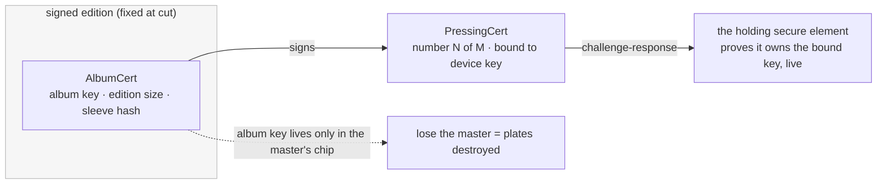

# secure element records demo

Finite editions of digital works, enforced by silicon. An artist device "cuts
a master" of an album (edition size and press counter captive in a secure
element), then "presses" numbered copies onto other devices through an
untrusted relay. Anyone can verify a copy offline: certificate chain +
live challenge-response, no server, no chain, no trust in the middleman.

Runs on two Ledger Flex (or two emulated ones: everything below works with
zero hardware).

## How it works

```mermaid
sequenceDiagram
    actor AH as Artist
    participant A as Flex A · master
    participant R as Laptop · untrusted relay
    participant B as Flex B · receiver
    actor BH as Collector

    rect rgb(240,240,240)
    Note over A: CUT
    AH->>A: upload sleeve, cut album, edition of 5
    A->>A: TRNG album key; seal sleeve hash + edition<br/>into a signed AlbumCert (never leaves the chip)
    end

    rect rgb(240,240,240)
    Note over A,B: PAIR — commit-reveal ECDH through the relay
    A->>R: commitment
    R->>B: commitment
    B->>R: ephemeral key
    R->>A: ephemeral key
    A->>R: reveal
    R->>B: reveal
    Note over A,B: both screens show the SAME 4 words
    AH-->>BH: compare words out loud
    AH->>A: tap "Words match"
    BH->>B: tap "Words match"
    Note over A,R,B: a lying relay makes the words differ → humans abort
    end

    rect rgb(240,240,240)
    Note over A,B: PRESS
    B->>R: request (device pubkey B)
    R->>A: request
    A->>A: counter 5 → 4 in silicon,<br/>sign PressingCert bound to pubkey B
    A->>R: PressingCert
    R->>B: PressingCert
    BH->>B: tap "Receive"
    end

    rect rgb(240,240,240)
    Note over B: VERIFY — offline, no network
    BH->>B: challenge (random nonce)
    B->>BH: signature by device key + cert chain
    Note over BH: GENUINE: pressing 1 of 5, bound to this device
    end
```



## The ceremony

1. **Cut** - Flex A confirms "Cut master of *Nuits Roses*, edition of 5".
   The edition size is fixed forever; losing the device destroys the plates.
2. **Pair** - the two devices run a commit-then-reveal ECDH through the relay;
   both screens show the same 4 words. The humans compare them out loud: a
   man-in-the-middle relay cannot make the two screens agree.
3. **Press** - A signs "pressing 1 of 5, bound to device B's key" and its
   counter decrements in silicon, atomically, before the certificate leaves.
   At 0: sold out, forever.
4. **Verify** - offline: chain verification plus a nonce the holder's secure
   element signs live.

See [docs/protocol.md](docs/protocol.md) for the full protocol and threat
model, and [docs/screens/](docs/screens) for a captured run.

## Layout

- `device-app/` - the Ledger app (Rust, `#![no_std]`, NBGL), targets Flex
- `tests/` - pytest over one or two Speculos instances, including adversarial
  relay tests (MITM key substitution, replay, SAS grinding, cert tampering)
- `relay/` - the untrusted relay: emulator cockpit (two clickable screens +
  live APDU wire on `:5050`), step-by-step ceremony driver, HID transport for
  real devices
- `scripts/` - build (WSL/aarch64-friendly), emulators, sideloading, captures

## Run it

Toolchain (Linux/WSL): rustup + `cargo-ledger` + clang + `gcc-arm-none-eabi`,
the [ledger-secure-sdk](https://github.com/LedgerHQ/ledger-secure-sdk) checked
out at `API_LEVEL_26` (`FLEX_SDK` env var), Speculos + pytest in a venv.
Adapt `scripts/env.sh` to your paths, then:

```
scripts/build.sh        # cargo ledger build flex
scripts/test.sh         # 11 tests, ~30 s, two emulated Flex
scripts/emu-up.sh       # two persistent emulators (:5001, :5002)
scripts/cockpit.sh      # clickable dual-screen cockpit + APDU wire (:5050)
python3 relay/demo_steps.py cut   # then: pair, press, verify
```

Real hardware: [docs/m5-hardware.md](docs/m5-hardware.md) (sideloading via
`ledgerctl`, USB-to-WSL passthrough, same ceremony on two physical Flex).

## Status & honest caveats

- Protocol, app, adversarial suite and emulated demo: working (M1-M4 green).
- Live two-device hardware demo: pending (M5, tooling ready).
- v1 has **no remote attestation**: the "edition can never exceed N" claim is
  enforced against everyone except a malicious operator running a modified
  app; the fallback is fraud-evidence (two certs with the same number are
  mutually incriminating). Closing that gap needs BOLOS endorsement, tracked
  in the docs.
